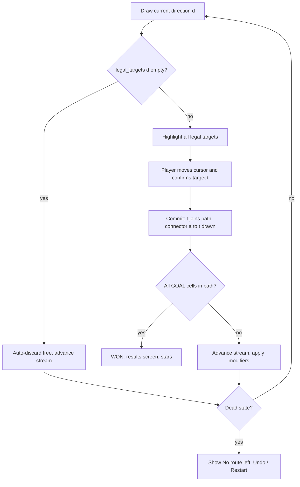
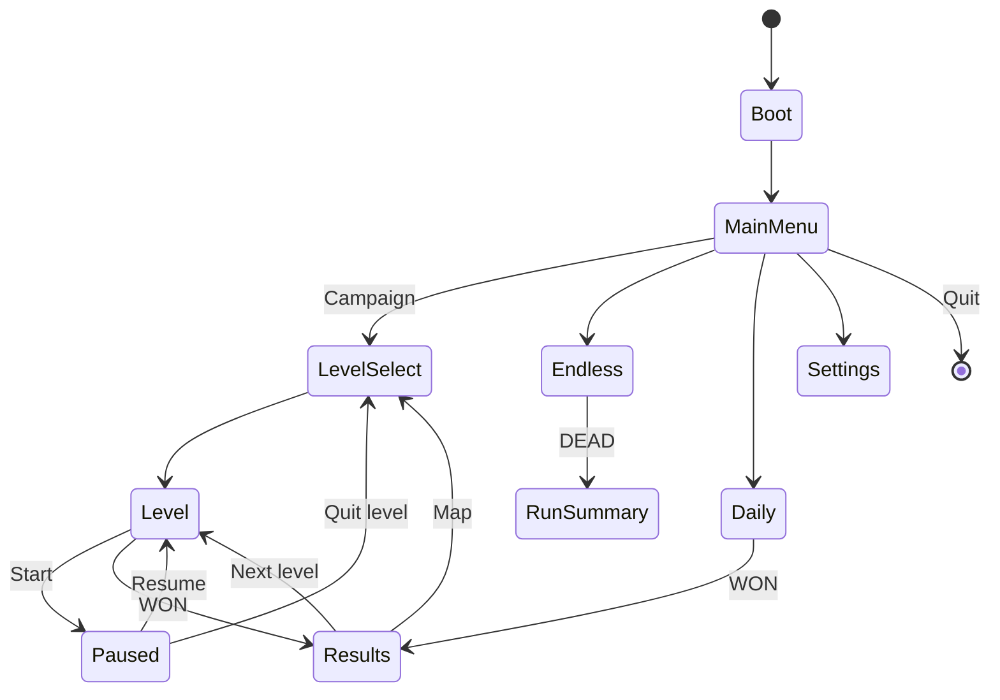
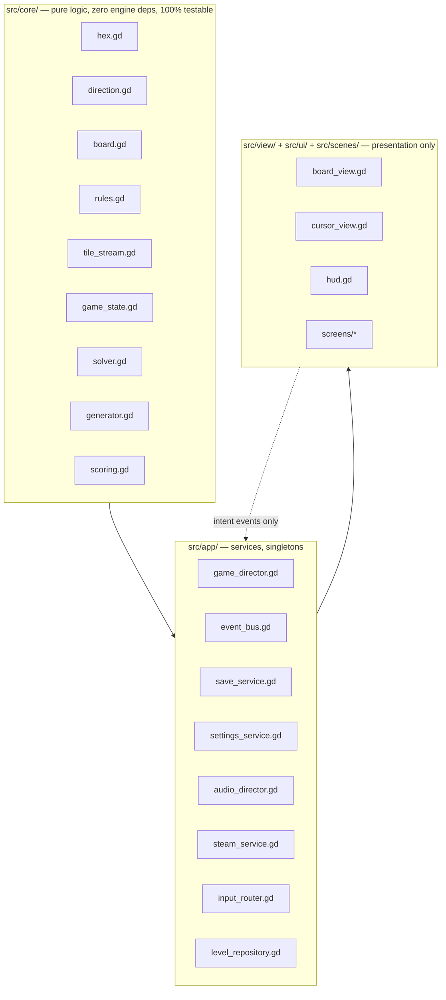

# Hexflow — Requirements & Build Specification

> **Purpose.** This document is a self-contained brief for rebuilding a 2016 libGDX hex-puzzle prototype
> as a modern, controller-first, Steam Deck–ready commercial release. It is written to be dropped into a
> **fresh LLM context** with no access to the original repository: every rule, constant, coordinate and
> asset requirement needed to build the game is stated here.
>
> **Working title:** Hexflow
> **Target engine:** Godot 4.5+ (GDScript)
> **Primary platform:** Steam Deck (Linux), plus Windows / macOS / Linux desktop on Steam
> **Scope:** Compact premium single-player puzzler — ~60 authored levels + endless + daily
> **Document status:** Authoritative for design and architecture. Version 1.0.

---

## Table of Contents

1. [How to use this document](#1-how-to-use-this-document)
2. [Product definition](#2-product-definition)
3. [Heritage: the 2016 prototype](#3-heritage-the-2016-prototype)
4. [Hex coordinate system](#4-hex-coordinate-system)
5. [Core rules specification](#5-core-rules-specification)
6. [Cell modifiers and mechanic ladder](#6-cell-modifiers-and-mechanic-ladder)
7. [Modes](#7-modes)
8. [Level generation, solving and par](#8-level-generation-solving-and-par)
9. [Campaign content plan](#9-campaign-content-plan)
10. [Tutorial specification](#10-tutorial-specification)
11. [Input, controller and Steam Deck](#11-input-controller-and-steam-deck)
12. [UI/UX specification](#12-uiux-specification)
13. [Art direction](#13-art-direction)
14. [Animation and feel](#14-animation-and-feel)
15. [Audio](#15-audio)
16. [Technical architecture](#16-technical-architecture)
17. [Data schemas](#17-data-schemas)
18. [Persistence, save and suspend/resume](#18-persistence-save-and-suspendresume)
19. [Determinism](#19-determinism)
20. [Performance budget](#20-performance-budget)
21. [Accessibility](#21-accessibility)
22. [Localization readiness](#22-localization-readiness)
23. [Steamworks integration](#23-steamworks-integration)
24. [Testing and acceptance criteria](#24-testing-and-acceptance-criteria)
25. [Build, CI and release](#25-build-ci-and-release)
26. [Implementation milestones](#26-implementation-milestones)
27. [Explicit non-goals](#27-explicit-non-goals)
28. [Appendix A — direction table](#appendix-a--direction-table)
29. [Appendix B — defects of the original, do not reproduce](#appendix-b--defects-of-the-original-do-not-reproduce)
30. [Appendix C — open decisions](#appendix-c--open-decisions)

---

## 1. How to use this document

### 1.1 For the implementing agent

Read sections 4, 5, 16 and 24 before writing any code. They define the coordinate math, the ruleset,
the architecture boundary and the acceptance criteria. Everything else is layered on top of those.

**Build order is not negotiable:** implement and test the pure logic core (§16.2) *before* any rendering.
The core must run headless with zero scene-tree dependencies, and its acceptance tests (§24) must pass
before art, animation or audio work begins. This ordering exists because the original prototype died from
the opposite approach — rendering and rules were fused inside a `Screen` class and became untestable.

**Hard constraints on the implementation:**

| # | Constraint | Rationale |
|---|---|---|
| C1 | Game logic lives in `src/core/` and may not `import`/reference any node, scene, texture, or `Input` API | Headless testability; the original's fatal flaw |
| C2 | All randomness flows through a seeded `RandomNumberGenerator` instance owned by `TileStream`/`Generator`. No global `randi()`/`randf()` anywhere | Determinism, replay, daily puzzles |
| C3 | Cell coordinates are value-equal, immutable, integer-only. Never use floats in logic | The original lost `equals`/`hashCode` and every grid lookup silently failed |
| C4 | No resource allocation (textures, materials, arrays) inside `_process`/`_draw` | The original allocated a `Texture` per tile draw |
| C5 | Every visible state must be distinguishable without colour (glyph, pattern, or stroke weight) | Accessibility, §21 |
| C6 | Every interaction must be completable with gamepad only, and separately with touch only | Deck Verified, §11 |
| C7 | Any behaviour not specified here is a question, not a licence to invent. Log it in §Appendix C and pick the simplest option | Scope control |

### 1.2 Suggested kickoff prompt

> Build Milestone M1 from HEXFLOW-SPEC.md: the pure logic core in `src/core/` plus its GUT test suite.
> Implement exactly §4 (coordinates), §5 (rules), §19 (determinism). Do not create any scenes, shaders or
> art. Exit criteria: every Gherkin scenario in §24.2 tagged `@core` passes headlessly, and the property
> test in §24.4 passes over 10,000 seeds.

---

## 2. Product definition

### 2.1 Elevator pitch

You are dealt one direction at a time. Grow a glowing path across a honeycomb board to reach the goal —
using the direction you were given, not the one you wanted. Hexflow is a calm, tactile, single-sitting
puzzle game about making good decisions with imperfect options.

### 2.2 Design pillars

| Pillar | Meaning | Consequence |
|---|---|---|
| **Readable in one glance** | The whole board, the current tile, and every legal move are visible without scrolling, zooming or hovering | Board caps at 61 cells; all legal targets are highlighted permanently, not on hover |
| **Constraint, not chaos** | The randomness is *known and fair* — campaign levels are fixed sequences, previews show what's coming, and an impossible draw is never punished | Fixed seeds per campaign level; 2-tile preview; free auto-discard (§5.7) |
| **Every input feels good** | One press = one clear, animated, audible consequence | §14 timings, §15 pentatonic placement scale, haptics (§11.5) |
| **No punishment for thinking** | No timers, no lives, unlimited undo in campaign, restart is one press | §5.9, §21 |

### 2.3 Target player and comparables

Puzzle players who bounce off twitch and difficulty spikes; Steam Deck owners looking for
15-minute-session games with instant suspend/resume. Tonal comparables: *Hexcells*, *Mini Metro*,
*Dorfromantik*, *A Monster's Expedition*. Mechanical comparables: pipe/path-laying puzzlers with a
draw queue.

### 2.4 Success criteria for the build

The release is complete when all of the following are true:

- All 60 campaign levels are solvable, have a verified par, and are reachable through the level select.
- Endless and daily modes run with seeded determinism and post to Steam leaderboards.
- Full gamepad-only playthrough is possible from boot to credits, verified on Deck hardware or a
  1280×800 emulated window at Deck's default settings.
- The Deck Verified checklist (§23.4) passes on self-audit.
- All `@e2e` acceptance scenarios (§24.2) pass in CI.

---

## 3. Heritage: the 2016 prototype

The original was a ~770-line libGDX 1.9.2 prototype (`com.hexgame`), first written in Java, then
machine-translated to Scala 2.11, targeting desktop/Android/iOS/GWT. It never became playable — the
translation dropped value equality on the coordinate type, so every grid lookup returned null.

### 3.1 What the prototype established (carry forward)

These facts are extracted from the original source and art and are **authoritative** — the remake keeps
them because they are the identity of the game.

| Element | Original implementation | Keep? |
|---|---|---|
| Board shape | Hexagon of radius 3 = 37 cells, built as rows of 4,5,6,7,6,5,4 | Yes, as the default board |
| Cell orientation | Pointy-top hexagons, art at 108×124 px (ratio 0.871 ≈ √3/2) | Yes |
| Coordinate system | Cube coordinates `(x, y, z)` with `x + y + z = 0` | Yes |
| Direction set | Six named sides `A…F`, each a cube delta, each drawn as one highlighted hex edge | Yes, renamed to compass names (§4.2) |
| Start cell | `(-3, 0, 3)` — bottom-left corner of the hexagon | Yes |
| Goal cell | `(3, 0, -3)` — top-right corner, cube distance 6 from start | Yes |
| Core loop | Draw a random direction; commit it against a cell; the neighbour in that direction joins the path | Yes, tightened in §5 |
| Obstacles | N randomly blocked, unusable cells | Yes, with a solvability guarantee added |
| Win condition | Graph search proving the goal is connected to the start through path cells | Yes, simplified to an invariant (§5.6) |
| Progression | Level index increments; obstacle count = level index | Replaced by authored chapters (§9) |
| Visual identity | Thin dark outline, near-white cell fill, single saturated accent edge marking the direction | Yes — this becomes the neon-on-dark language of §13 |

### 3.2 Reconstructed intent

The prototype's literal code let the player click *any* unclaimed cell anywhere on the board, and the
clicked cell did not itself join the path — only its neighbour did. That is incoherent as a game. The
evident intent, given the art (a hex with one edge lit) and the connectivity check, is:

> A drawn direction extends your existing path by one cell, along that direction.

§5 specifies that intent precisely and unambiguously. Note the elegant consequence derived in §5.4: because
the direction is fixed by the draw, each legal target cell maps to exactly one anchor, so the player's
interaction stays exactly what it was in 2016 — *tap a highlighted cell* — with no ambiguity to resolve.

---

## 4. Hex coordinate system

### 4.1 Cube coordinates

A cell is an immutable integer triple `(x, y, z)` with the invariant `x + y + z == 0`.

```gdscript
# src/core/hex.gd  — value type, no engine dependencies
class_name Hex

static func key(x: int, y: int, z: int) -> Vector3i:
    assert(x + y + z == 0)
    return Vector3i(x, y, z)

static func add(a: Vector3i, b: Vector3i) -> Vector3i:
    return a + b

static func distance(a: Vector3i, b: Vector3i) -> int:
    var d := a - b
    return maxi(maxi(absi(d.x), absi(d.y)), absi(d.z))
```

**Use `Vector3i` as the cell key.** It is value-comparable and hashable in Godot, which structurally
prevents the original's fatal bug. Never wrap it in a `RefCounted` class used as a dictionary key.

A radius-`R` hexagonal board is the set:

```
cells(R) = { (x, y, z) : x + y + z = 0 and max(|x|, |y|, |z|) <= R }
```

`|cells(R)| = 3R² + 3R + 1` → R=2: 19 cells, R=3: 37 cells, R=4: 61 cells.

### 4.2 Directions

Six directions. The original names (`SIDE_A`…`SIDE_F`) map to compass names as follows; **this mapping is
verified against the original tile art** and must not be permuted.

| Enum | Original | Cube delta `(dx, dy, dz)` | Lit hex edge | Screen angle (y-down, CW from +x) |
|---|---|---|---|---|
| `NW` | `SIDE_A` | `( 0, +1, -1)` | upper-left | 240° |
| `NE` | `SIDE_B` | `(+1,  0, -1)` | upper-right | 300° |
| `E`  | `SIDE_C` | `(+1, -1,  0)` | right | 0° |
| `SE` | `SIDE_D` | `( 0, -1, +1)` | lower-right | 60° |
| `SW` | `SIDE_E` | `(-1,  0, +1)` | lower-left | 120° |
| `W`  | `SIDE_F` | `(-1, +1,  0)` | left | 180° |

Directions are stored as an int enum `0..5` in the order above. `opposite(d) == (d + 3) % 6`.
Iteration order is fixed and used by the tile bag (§5.3) and by all solvers, so it must be stable
across platforms.

### 4.3 Cube → pixel layout (pointy-top)

> The formula below is unchanged, but it now projects onto the **ground plane** of an orthographic 3D
> board rather than straight to the screen — see **C-18**.

Let `s` = circumradius in pixels (centre to vertex). Convert with axial `q = x`, `r = z`:

```
px = s * sqrt(3) * (q + r / 2)
py = s * 1.5 * r
```

Godot 2D is y-down, so `r = +3` lands at the bottom of the screen and `r = -3` at the top. This
reproduces the original's layout exactly: start `(-3,0,3)` renders bottom-left, goal `(3,0,-3)`
top-right.

Derived geometry: hex width `= s * sqrt(3)`, height `= s * 2`, vertical row pitch `= s * 1.5`,
horizontal column pitch `= s * sqrt(3)`.

Inverse (pixel → cell, for touch and mouse) uses fractional cube coordinates plus cube rounding:

```
q_f = (px * sqrt(3)/3 - py / 3) / s
r_f = (py * 2/3) / s
```
then round `(q_f, -q_f - r_f, r_f)` by rounding all three and correcting the component with the largest
rounding delta so the sum returns to zero.

### 4.4 Board sizing on screen

> The footprint below is the board's size **on its own plane**. An oblique camera foreshortens it, so
> the fit rule is applied to the projected bounds instead — see **C-18**.

For a radius-`R` hexagonal board, the full rendered footprint is:

```
width  = sqrt(3) * s * (2R + 1)
height = s * (3R + 2)
```

Rule: pick the largest integer `s` such that the footprint plus a 48 px margin on every side fits inside
the play area. At the 1280×800 reference, the play area is the viewport minus the 400 px HUD rail, the
56 px top bar and the 56 px banner strip (§12.3) → **880 × 688**, so the usable box is **784 × 592**.
The banner strip is reserved even while hidden, so the board never resizes when a banner appears.

| Board radius | Cells | `s` (px) | Footprint | Limiting axis |
|---|---|---|---|---|
| 2 | 19 | 74 | 641 × 592 | height |
| 3 | 37 | 53 | 642 × 583 | height |
| 4 | 61 | 42 | 655 × 588 | height |

Cell width is `sqrt(3)·s` and height `2·s`, so a radius-3 cell renders at 92 × 106 px — close to the
original art's 108 × 124. Never scroll or pan the board in normal play.

---

## 5. Core rules specification

This section is normative. Ambiguity here is a bug.

### 5.1 State

```
GameState = {
    board:        Dictionary[Vector3i -> Cell]   # the level's cells; absent key = off-board
    path:         Set[Vector3i]                  # cells joined to the network, includes start
    edges:        Array[(Vector3i, Direction)]   # ordered connectors, one per placement
    stream:       TileStream                     # seeded direction source
    discards_left: int
    placements:   int                            # count of committed placements
    history:      Array[Move]                    # for undo
    status:       PLAYING | WON | DEAD
}

Cell = { kind: EMPTY | WALL, flags: {START, GOAL, PORTAL(id), GATE, WILD} }
```

`path` is always a **tree** rooted at `start`: every placement attaches exactly one new cell to a cell
already in `path`. Therefore connectivity never needs to be recomputed.

### 5.2 Setup

1. `path = { start }`. `start` is a normal cell flagged `START`.
2. `goal` cells are normal cells flagged `GOAL`; they are **not** in `path` at setup. There is at least one.
3. `WALL` cells are permanently unusable and may never enter `path`.
4. `discards_left` = the level's `discards` value (default 3).
5. `stream` is initialised from the level's seed or explicit tile array (§5.3).
6. `status = PLAYING`.

### 5.3 Tile stream

The stream yields one `Direction` at a time and supports peeking 2 ahead (the preview queue shows
*current + next 2*).

**Bag algorithm** (prevents droughts, keeps randomness fair):

```
loop:
    bag = [NW, NE, E, SE, SW, W]
    shuffle(bag, rng)      # Fisher-Yates using the seeded rng, descending index
    yield each element of bag in order
```

The shuffle must be a canonical descending-index Fisher-Yates so the sequence is reproducible from the
seed on every platform. `stream.index` is part of the state and is rewound by undo.

Campaign levels may instead carry an explicit `tiles: [Direction]` array; when present it overrides the
bag and is consumed in order. If an explicit array is exhausted, the level is a fixed-budget level and
the run ends (see §5.8).

### 5.4 Placement legality

Given the current direction `d`:

```
legal_targets(state, d) =
    { t : a ∈ state.path,
          t = a + delta(d),
          t ∈ state.board,
          state.board[t].kind != WALL,
          t ∉ state.path,
          gate_satisfied(state, t) }
```

**Key property:** for a fixed `d`, the map `a → a + delta(d)` is injective, so every element of
`legal_targets` has exactly one anchor. The player therefore selects a *target cell*, and the anchor and
connector are derived — the interaction is a single confirm on a highlighted cell.

`gate_satisfied(state, t)` is `true` unless `t` is flagged `GATE`, in which case it requires
`|{ n : n ∈ neighbours(t) and n ∈ state.path }| >= 2` **after** counting the incoming anchor.

### 5.5 Commit

On confirming target `t` with anchor `a` and direction `d`:

1. Push `Move { target: t, anchor: a, dir: d, stream_index_before, discards_before, portal_twin }`
   onto `history`.
2. `path.add(t)`; `edges.append((a, d))`; `placements += 1`.
3. If `t` is flagged `PORTAL(id)`, immediately also add its twin cell to `path` and record an implicit
   edge (portals teleport the network; the twin becomes a new growth frontier).
4. If `t` is flagged `WILD`, grant `wild_charges += 1` (§6).
5. Advance the stream.
6. Re-evaluate `status` (§5.6, §5.8).

### 5.6 Win condition

```
status = WON  when  every cell flagged GOAL is in path
```

No graph search. This is a strict improvement over the original's BFS and is O(1) per placement with a
maintained counter. (Keep a BFS utility anyway — the solver, the dead-state check and the hint system
need it.)

### 5.7 Discards and the fairness rule

- Pressing **Discard** consumes one `discards_left` and advances the stream without placing.
- **Fairness rule (mandatory):** if `legal_targets(state, current)` is empty, the tile is auto-discarded
  **free** — no charge consumed, with a distinct visual and audio beat ("no move — skipped"). The player
  is never punished for an impossible draw. The auto-discard repeats until a placeable tile appears or
  the state is dead.
- `discards_left == 0` does not end the level; it only removes the voluntary option.

### 5.8 Dead state

The level is dead when the goal has become unreachable *even with perfect future draws*. Check after
every commit and every discard:

```
reachable(state) = BFS from any cell in state.path,
                   traversing to neighbours n where
                       n ∈ board, board[n].kind != WALL, n ∉ path
                   (ignore direction, ignore GATE — this is an optimistic bound)
status = DEAD  when  some GOAL cell is not in path and not in reachable(state)
```

Also `DEAD` when an explicit `tiles` array is exhausted before the goal is reached.

On `DEAD`, do **not** hard-fail the player. Present a non-modal banner — *"No route left"* — offering
**Undo** (default focus) and **Restart**. Campaign has no failure state; a dead board is a recoverable
mistake.

### 5.9 Undo and restart

- **Campaign:** undo is unlimited and rewinds one `Move` completely, including the stream index, discard
  count, portal twin, and wild charges. Undo across an auto-discard rewinds the auto-discards too.
- **Endless / Daily:** undo is unavailable (leaderboard integrity). Restart is available; in Endless it
  ends the run.
- Restart resets to §5.2 with the identical seed, so a level is byte-identically reproducible.

### 5.10 Scoring and stars

`placements` is the only score in campaign — lower is better.

| Stars | Condition |
|---|---|
| ★★★ | `placements <= par` |
| ★★ | `placements <= par + 3` |
| ★ | level completed |

`par` is computed by the solver (§8.3) and stored in the level file. It is the minimum placements needed
given that level's exact tile sequence, so ★★★ is always attainable and never luck-dependent in campaign.

Endless score is `goals_reached`, tie-broken by fewer `placements`.

### 5.11 Rule summary diagram



---

## 6. Cell modifiers and mechanic ladder

Exactly five modifiers ship. Each is introduced by one chapter and reused thereafter. Do not invent more.

| Modifier | Rule | Visual | Introduced |
|---|---|---|---|
| `WALL` | Never enters `path`. Blocks routes. | Dark fill, 45° hatch pattern, no glow | Ch. 2 |
| `GOAL` | Win requires all goal cells in `path`. Multiple goals force branching. | Amber ring, slow 2 s pulse, target glyph | Ch. 1 (single), Ch. 3 (multi) |
| `PORTAL(id)` | Paired. Entering one adds its twin to `path` immediately, creating a second frontier. | Violet, two concentric rings, matching id numeral, faint tether line to twin | Ch. 4 |
| `GATE` | Can only be entered when it will have ≥2 path neighbours (counting the incoming anchor). | Blue, padlock glyph, lock opens when the condition becomes satisfiable | Ch. 4 |
| `WILD` | Entering it grants one **wild charge**. Spending a charge lets the next placement use any direction the player chooses. | Yellow, star glyph, charge counter in HUD | Ch. 5 |

Level-scoped constraints (not cell modifiers):

| Constraint | Rule | Introduced |
|---|---|---|
| `tiles` (fixed sequence) | Explicit direction array; exhaustion ends the level | Ch. 1 (all campaign levels use this) |
| `discards` | Voluntary discard charges, default 3, may be 0 | Ch. 2 |
| `budget` | Hard cap on `placements`; exceeding it is `DEAD` | Ch. 5 |

**Wild charge interaction:** with a charge available, the confirm on a cell adjacent to any path cell is
legal; the player picks the target and the direction is inferred from anchor→target. Spending is explicit
(a separate button, §11.3) so it is never accidental.

---

## 7. Modes

### 7.1 Campaign

60 authored levels in 5 chapters of 12. Each level is a fixed board + fixed tile sequence + verified par.
Levels unlock linearly within a chapter; a chapter unlocks when the previous chapter has 8 of 12 levels
completed (so a stuck player is never fully blocked). Stars are tracked per level; totals gate
achievements only, never content.

### 7.2 Endless

One escalating run on a radius-3 board with a bag-based infinite stream.

```
start of run: 0 walls, 1 goal, path = { start }
on reaching a goal:
    goals_reached += 1
    the reached goal becomes the new start
    path = { new start }                 # board clears of path, keeps walls
    walls += 1                            # a new wall spawns on a cell that keeps the next goal reachable
    a new goal spawns at cube distance >= 4 from the new start
run ends when status == DEAD
```

Score = `goals_reached`. No undo. Posts to the `endless_best_goals` leaderboard. This reuses the entire
core with no new rules.

### 7.3 Daily

One puzzle per UTC day, seed = `hash("hexflow-daily" + YYYYMMDD)`. Radius-3 board, generated by §8 with
fixed difficulty parameters, verified solvable at generation time on the client. Unlimited retries; the
best result posts to a rolling daily leaderboard. Shows a 7-day streak indicator. No undo (restart only),
so a shared board is comparable between players.

---

## 8. Level generation, solving and par

### 8.1 Why a generator at all

Campaign levels are authored data files, but they are *produced* with the generator and then verified —
hand-authoring 60 solvable boards with valid tile sequences and true pars by hand is error-prone. The
generator is also the runtime source for Endless and Daily.

The original prototype had no solvability guarantee at all: it blocked random indices `1 … size-1`, which
could and did block the goal cell itself, producing unwinnable levels. That class of bug must be
impossible here — enforced by §8.4's property test.

### 8.2 Generation algorithm

```
generate(seed, params) -> Candidate:
    rng = RandomNumberGenerator with seed
    1. cells      = hexagon(params.radius)
    2. start      = pick from the outer ring
       goal(s)    = pick so that distance(start, goal) >= params.min_distance
                    and pairwise goal distance >= 3
    3. carve       a reserved solution route: random walk start -> each goal,
                   biased toward the goal, wander length = distance + params.wander
    4. walls       = sample params.wall_count cells from (cells - reserved - start - goals)
    5. modifiers   = place params.portals / gates / wilds on non-reserved cells only,
                     except gates which may sit ON the reserved route if the route
                     approaches them with a fork (verify in step 7)
    6. tiles       = the direction steps of the reserved route, then padded and
                     interleaved with decoy tiles drawn from the seeded bag,
                     total length = route_length + params.slack
    7. verify      = solve(candidate)         # §8.3
       if not solvable: reject, retry with seed+1 (cap 200 attempts, then relax params)
    8. par         = solver optimal placements
```

Steps 3 and 6 make solvability *likely*; step 7 makes it **certain**. Never ship a candidate that
skipped step 7.

### 8.3 Solver

State = `(frozen path set, stream index, discards left, wild charges)`.

- **Search:** iterative-deepening / bounded best-first search. Heuristic `h` = sum over unreached goals of
  `min over p in path of distance(p, goal)` — admissible, since each placement reduces the minimum
  distance to a goal by at most 1.
- **Bounds:** cap expanded states at 200 000 and depth at `params.slack + route_length`. Exceeding the
  cap returns `UNKNOWN`, which is treated as *reject* at generation time.
- **Output:** `SOLVABLE(par, move_list)` | `UNSOLVABLE` | `UNKNOWN`.
- **Reuse:** the solver also powers the hint system (§12.6) — a hint replays the solver from the current
  live state and highlights the first move of the returned optimal continuation.

The solver must be a pure `src/core/` module and must not mutate the live `GameState`.

### 8.4 Difficulty parameters

| Chapter | Radius | Walls | Min dist | Wander | Slack | Discards | Modifiers |
|---|---|---|---|---|---|---|---|
| 1 — Flow | 2→3 | 0–2 | 3–5 | 0–1 | 4 | 3 | none |
| 2 — Walls | 3 | 4–8 | 5–6 | 1–2 | 4 | 3 | walls |
| 3 — Branches | 3 | 5–9 | 5–6 | 2 | 5 | 2 | 2–3 goals |
| 4 — Gates & Portals | 3 | 6–10 | 6 | 2–3 | 5 | 2 | portals, gates |
| 5 — Pressure | 3→4 | 8–14 | 6–7 | 3 | 3 | 0–2 | all + budget |

Endless params: radius 3, walls = `goals_reached`, min_distance 4, wander 2, slack ∞ (infinite bag).
Daily params: radius 3, walls 7, min_distance 6, wander 2, slack 6, 2 goals, discards 2.

---

## 9. Campaign content plan

60 levels, 5 chapters × 12. Per chapter: levels 1–3 teach, 4–9 develop, 10–12 test. Difficulty within a
chapter is monotonic in `par` and in wall density.

| Ch | Name | Teaches | Level 1 exists to show | Chapter-final challenge |
|---|---|---|---|---|
| 1 | Flow | Draw, place, reach goal, preview queue, undo | That a lit edge means a direction and the path grows one cell | Radius-3 board, tight slack, no walls |
| 2 | Walls | Walls, voluntary discard, dead-end recovery | That a wall is a permanent no | A corridor board where one wrong turn is fatal-but-undoable |
| 3 | Branches | Multiple goals, branching from any path cell | That the path is a tree, not a line | Three goals reachable only by an early fork |
| 4 | Gates & Portals | Gate 2-neighbour rule, portal pairs | That a gate needs to be approached twice | A portal chain crossing a full wall barrier |
| 5 | Pressure | Wild charges, placement budget, radius-4 boards | That a wild charge is worth saving | Radius-4, 14 walls, budget = par + 2, 0 discards |

**Level select:** a hex-flower map. Each chapter is a radius-1 hex cluster of 7 + a second row of 5;
completed levels fill with the path colour, star counts shown as 1–3 pips. The map itself uses the same
board renderer — no separate UI system.

**Authoring workflow (for the implementing agent):** run the generator with the chapter's params over a
seed range, keep candidates whose `par` falls in the target band and whose solution uses the chapter's
mechanic non-trivially, write the winners to `src/data/levels/chapter_N/level_MM.json`, and commit the
files. Generated levels are then **frozen data** — never regenerate at runtime, never re-seed on load.

---

## 10. Tutorial specification

The tutorial is not a mode; it is scripted, skippable, replayable guidance woven into Chapter 1 levels
1–5, plus one beat per new modifier at its introducing level.

### 10.1 Principles

- **Never more than 12 words on screen at once.** Show, don't explain.
- **Diegetic.** Guidance renders on the board (a pulsing target ring, a ghost connector), not in a modal.
- **Non-blocking after the first beat.** Beat 1 gates input to the single correct cell; every later beat
  merely highlights and lets the player ignore it.
- **Replayable** from Settings → "Replay tutorial", which resets the tutorial flags only.
- **Skippable** at any time with a single Back press; skipping sets all flags seen.

### 10.2 Beats

| # | Trigger | On-screen text | Interaction | Completion |
|---|---|---|---|---|
| T1 | Ch1 L1 first frame | *"Your tile points north-east."* | Only the one legal target accepts input; it pulses | Player places |
| T2 | After T1 commit | *"The path grows. Reach the goal."* | Goal ring pulses once | Player places again |
| T3 | Ch1 L2 start | *"Next two tiles are shown here."* | Preview queue scales up 1.15× and settles | 2 s or first input |
| T4 | Ch1 L3, first branch opportunity | *"Grow from any path cell."* | Two non-adjacent legal targets both pulse | Player places |
| T5 | Ch1 L4, after any placement | *"Undo is free. Always."* | Undo button glows | Player presses Undo, or 4 s |
| T6 | Ch1 L5, first forced auto-discard | *"No legal move — tile skipped, no cost."* | Skipped tile flies off with its own sound | Automatic |
| T7 | Ch2 L1, cursor near a wall | *"Walls never open."* | Wall shakes 2 px when targeted | Automatic |
| T8 | Ch2 L2 | *"Discard a tile you can't use."* | Discard button glows, count shown | Player discards, or 6 s |
| T9 | Ch3 L1 | *"Two goals. Plan the fork."* | Both goals pulse alternately | 2 s |
| T10 | Ch4 L1, first gate in view | *"Gates need two connections."* | Gate shows two ghost stubs | 3 s |
| T11 | Ch4 L4, first portal | *"Portals link both ends."* | Tether line between twins brightens | 3 s |
| T12 | Ch5 L1, first wild pickup | *"Wild: choose any direction once."* | HUD charge slot fills with a pop | 3 s |

Each beat writes a boolean into `save.tutorial_flags` so it never repeats. Beats must be data-driven
(`src/data/tutorial.json`), not hardcoded in level scripts.

---

## 11. Input, controller and Steam Deck

Controller is the **primary** input. Mouse and touch are equal-class alternatives. Keyboard is supported.
No interaction may be exclusive to one device.

### 11.1 Steam Input action sets

| Action set | Active during |
|---|---|
| `Menu` | Boot, main menu, level select, settings, results |
| `Board` | In a level |
| `Modal` | Pause, confirmation dialogs, tutorial gate |

### 11.2 Cursor navigation on a hex grid

The hard problem is D-pad/stick navigation over a hex lattice. Two schemes; **snap** is the default.

**Snap-to-candidate (default).** The cursor only ever occupies a cell in `legal_targets`. A directional
input picks the candidate whose screen-space bearing from the current cursor best matches the input
vector, within a ±75° acceptance cone, preferring the nearest on ties. If no candidate is inside the
cone, the cursor does not move and a soft rejection tick plays. This makes every press land on a legal
move — the fastest possible input for the common case.

**Free cursor (Settings option).** The cursor moves cell-to-cell over all board cells using the six hex
bearings mapped to stick/D-pad octants (up → NW/NE split by horizontal bias). Confirm on an illegal cell
plays a rejection and does not commit. Needed by players who want to read the board with the cursor.

**Bumper cycling (always available, both schemes).** `L1`/`R1` step through `legal_targets` sorted by
bearing from the board centre, clockwise. This is the guaranteed-reliable fallback and the one the
tutorial teaches if the player struggles (3 failed cone rejections in a row → surface a hint toast).

### 11.3 Bindings

| Action | Gamepad | Keyboard | Mouse / Touch |
|---|---|---|---|
| Move cursor | Left stick / D-pad | Arrows / WASD | Hover / drag |
| Cycle targets | L1 / R1 | Q / E | — |
| Confirm placement | A | Space / Enter | Click / tap the cell |
| Undo | Y | Z / Backspace | Undo button |
| Discard tile | X | X | Discard button |
| Spend wild charge | L2 (hold) + A | Shift + Space | Wild button, then cell |
| Hint | R2 (hold 0.5 s) | H | Hint button |
| Pause / menu | Start | Esc | Pause button |
| Back / cancel | B | Esc | Back button |
| Toggle legend | Select / View | Tab | Legend button |
| Restart level | Hold Select 1 s | R | Menu → Restart |

`Hold` gestures for destructive actions (restart) are mandatory. Nothing destructive on a single press.

Keyboard discard is `X`, not `D`, so that WASD is whole — see **C-20**.

### 11.4 Deck hardware specifics

- Reference resolution 1280×800 (16:10). Support 16:9 and 21:9 desktop by letterboxing the board area and
  extending the background, never by cropping UI.
- The Deck has a touchscreen: every on-screen button must have a ≥44 px touch target at 1280×800.
- Trackpads act as mouse; the right trackpad may drive the free cursor.
- Show **Deck/Xbox glyphs matching the detected controller**. Never hardcode Xbox glyphs. Glyph set is a
  data-driven atlas keyed by `Input.get_joy_name`, with Deck-specific names for View/Menu.
- Handle suspend/resume: persist in-progress state on focus loss (§18.3).

### 11.5 Haptics

| Event | Pattern |
|---|---|
| Cursor moves to a candidate | 8 ms, weak |
| Cursor rejection | 2 × 6 ms, weak, 40 ms apart |
| Placement commit | 18 ms, medium, with a 60 ms weak tail |
| Auto-discard | 12 ms, weak |
| Goal reached | 40 ms medium → 120 ms ramp-down |
| Dead state | 3 × 20 ms, medium |

All haptics respect a Settings slider (0–100%, default 70%) and are disabled at 0.

---

## 12. UI/UX specification

### 12.1 Screen map



The state machine lives in one place (`GameDirector`, §16.3). No screen may push another screen directly.

### 12.2 Screen inventory and required content

| Screen | Must contain | Default focus |
|---|---|---|
| Boot | Logo, 1.2 s max, skippable by any input | — |
| Main menu | Campaign (with % complete), Endless (with best), Daily (with streak + timer to reset), Settings, Quit | Campaign |
| Level select | Hex-flower chapter map, per-level star pips, chapter progress, back | Last played level |
| Level | Board, tile queue, HUD rail, cursor, banner area | Cursor on a legal target |
| Paused | Resume, Restart (hold), Settings, Quit to map | Resume |
| Results | Stars earned (animated), placements vs par, Next / Replay / Map | Next |
| Run summary (Endless) | Goals reached, personal best, leaderboard slice (top 3 + friends + self), Retry / Menu | Retry |
| Settings | Tabs: Gameplay, Controls, Video, Audio, Accessibility | First tab |

### 12.3 Level screen layout at 1280×800

> **Superseded by C-18** on one point: the flat NEXT pair becomes a stack of the upcoming tiles. The
> band sizes, the rail width and the "board never overlaps the rail" rule are unchanged.

```
┌──────────────────────────────────────────────────────────────────────┐
│  ← Ch2 · Level 7          placements 11 / par 9        ★★☆   [Menu]  │ 56 px top bar
├───────────────────────────────────────────────┬──────────────────────┤
│                                               │  NOW                 │
│                                               │   ⬡  large tile      │
│                board play area                │  (140 px)            │
│                (880 × 688)                    │                      │
│                                               │  NEXT                │
│                                               │   ⬡ ⬡  (72 px)       │
│                                               │                      │
│                                               │  ── divider ──       │
│                                               │  ↺ Undo      Y       │
│                                               │  ✕ Discard 2 X       │
│                                               │  ★ Wild    0 L2      │
│                                               │  ? Hint      R2      │
├───────────────────────────────────────────────┴──────────────────────┤
│  banner area — tutorial text / dead-state prompt (hidden by default)  │ 56 px
└──────────────────────────────────────────────────────────────────────┘
                                                    right rail = 400 px
```

Rules: the board area never overlaps the rail. The banner slides in from the bottom and pushes nothing.
All rail buttons show their gamepad glyph *and* are directly clickable/tappable.

### 12.4 Feedback requirements

| Player action | Required feedback (all three channels) |
|---|---|
| Cursor move | Cursor ring snaps with 80 ms ease; tick sound; weak haptic |
| Illegal confirm | 120 ms 4 px shake + red flash; buzz; double haptic |
| Legal confirm | Cell pop + connector draw + flow pulse; next scale note; medium haptic |
| Goal reached | Board-wide ripple, particle burst, chord resolve, ramp haptic |
| Dead state | Banner slides in, board desaturates 30%, low tone, triple haptic |
| Auto-discard | Tile flies off-rail with trail, distinct airy sound, weak haptic |

### 12.5 Focus and navigation rules

- Exactly one focused element at all times in `Menu`/`Modal` sets; focus ring is 3 px, accent colour,
  animated in 100 ms, and never invisible.
- Focus wraps within a list, does not wrap between columns.
- `B`/Esc always goes up exactly one level of the state machine and never quits the game from gameplay.
- Opening the Steam overlay must pause gameplay automatically (`Level` → `Paused`).

### 12.6 Hint system

Hold `R2` 0.5 s → solver runs from the live state on a background thread (cap 250 ms; on timeout show
*"No hint available"*). On success, the recommended target pulses white for 2 s. Hints are unlimited but
counted; using ≥1 hint on a level marks its star display with a small dot and blocks the
`no_hints_chapter` achievement only.

---

## 13. Art direction

### 13.1 Direction statement

Modern minimalist, neon on near-black. Flat geometry, thin bright strokes, soft additive glow, generous
negative space. The board is a dark honeycomb of empty sockets; the path is a single continuous line of
light that grows and pulses. Nothing is textured, nothing is skeuomorphic, nothing is a photograph. The
2016 prototype's identity — thin outline, pale fill, one saturated accent edge — is inverted into light-on-dark
and kept.

**Everything is drawn procedurally** with signed-distance-field shaders and vector primitives. There are
no hex sprites, no pre-rendered PNGs for gameplay elements. This keeps the game crisp at any resolution,
makes glow and state transitions free, and means no external artist is required.

### 13.2 Palette tokens

Define once in `src/data/palettes/neon_dark.tres`; never hardcode a colour in a script or scene.

| Token | Hex | Use |
|---|---|---|
| `bg.deep` | `#0A0E14` | Window clear colour |
| `bg.panel` | `#121821` | Rail, cards, modal surfaces |
| `bg.vignette` | `#060910` | Radial vignette edge, 18% opacity |
| `cell.empty.fill` | `#131A24` | Empty cell interior |
| `cell.empty.stroke` | `#263241` | Empty cell outline, 2 px |
| `cell.candidate.stroke` | `#3E5470` | Legal-target outline, 2.5 px, breathing |
| `path.core` | `#34E5C4` | Path fill and connectors |
| `path.glow` | `#34E5C4` @ 35% | Additive bloom around path |
| `path.gradient.far` | `#7C6BFF` | Gradient end for long paths (lerp by depth from start) |
| `start` | `#7CF3FF` | Start cell |
| `goal` | `#FFB43D` | Goal ring and glyph |
| `wall.fill` | `#1A1620` | Wall interior |
| `wall.stroke` | `#4A3A52` | Wall outline + 45° hatch |
| `portal` | `#B078FF` | Portal rings and tether |
| `gate` | `#6F8CFF` | Gate ring and padlock |
| `wild` | `#F7F16B` | Wild star and charge pip |
| `danger` | `#FF5470` | Illegal feedback, dead-state banner |
| `text.primary` | `#EAF2FF` | Headings, values |
| `text.secondary` | `#8FA3BF` | Labels, hints |
| `focus` | `#FFFFFF` | Focus ring |

### 13.3 Hex cell rendering

> **Superseded by C-18.** The board renders as orthographic 3D hex prisms in a `MultiMeshInstance3D`,
> not as a canvas-shader SDF. The single-draw-call and per-instance-custom-data requirements below
> carry over verbatim; the SDF listing is retained only as the reference for any 2D fallback and for
> the grey-box.

Draw all cells in **one** `MultiMeshInstance2D` of unit quads, with per-instance custom data carrying
state, so the whole board is a single draw call. Fragment shader sketch:

```glsl
// src/shaders/hex_cell.gdshader  (Godot 4 canvas_item shader)
// Pointy-top regular hexagon SDF.
// NOTE: r is the APOTHEM (inradius), not the circumradius. For a hex whose
// circumradius is 1.0 in local units, pass r = sqrt(3)/2 = 0.8660254.
float hex_sdf(vec2 p, float r) {
    p = vec2(p.y, p.x);                       // swap axes: flat-top -> pointy-top
    const vec3 k = vec3(-0.8660254, 0.5, 0.5773503);
    p = abs(p);
    p -= 2.0 * min(dot(k.xy, p), 0.0) * k.xy;
    p -= vec2(clamp(p.x, -k.z * r, k.z * r), r);
    return length(p) * sign(p.y);
}
// Usage: d = hex_sdf(uv_centered, 0.8660254);   // uv_centered in [-1,1], circumradius 1
//   fill      = smoothstep(0.0, -AA, d)
//   stroke    = smoothstep(STROKE + AA, STROKE, abs(d))
//   glow      = exp(-abs(d) * GLOW_FALLOFF) * intensity      // additive pass
//   AA        = fwidth(d) * 1.2                              // resolution-independent
```

Per-instance custom data: `x` = state enum, `y` = animation phase 0–1, `z` = depth-from-start
(normalised, drives the path gradient), `w` = highlight intensity.

Connectors between cells are drawn in a second pass as rounded capsules (a 1-D SDF) so the path reads as
one continuous stroke, with `path.core` at the anchor end lerped toward `path.gradient.far` by depth.

### 13.4 Typography

Open-licence fonts only (SIL OFL), embedded in the project.

| Role | Font | Size @1280×800 | Notes |
|---|---|---|---|
| Display / titles | Space Grotesk Bold | 48 px | Tight tracking |
| Headings | Space Grotesk Medium | 32 px | |
| Body / buttons | Inter Medium | 24 px | Minimum readable body size |
| Labels / captions | Inter Regular | 18 px | **Absolute floor — never smaller** |
| Numerals (counters, scores) | JetBrains Mono Medium | 24 px | Tabular figures so counters don't jitter |

The 18 px floor exists because the Deck screen is 7 inches; anything smaller fails a legibility
self-audit. Text scaling (§21) multiplies all of these by 1.0–1.5.

### 13.5 Iconography

Line icons, 2 px stroke, 24×24 grid, drawn as vector paths or an SVG-imported atlas: undo arrow, cross
(discard), star (wild), question (hint), padlock (gate), concentric rings (portal), target (goal),
hatch square (wall), hexagon (brand mark).

Every modifier is identified by **glyph + shape + colour**, never colour alone (§C5).

### 13.6 Asset list

| Asset | Format | Notes |
|---|---|---|
| Hex cell, connectors, cursor, rings, glow | Shader | No image files |
| Icons | SVG → single atlas | 9 icons, §13.5 |
| Controller glyphs | Atlas | Deck, Xbox, PlayStation, Switch sets |
| Fonts | TTF | 3 families, subset to Latin-Extended |
| Particles | Shader-driven `GPUParticles2D` | 4 emitters, §14.4 |
| Steam capsules | PNG | 6 sizes per Steamworks spec — verify current requirements at store-page setup |
| Logo / brand mark | SVG | Hexagon with an internal light path |

---

## 14. Animation and feel

Feel is the product. Every timing below is a requirement, not a suggestion. All easing names refer to
Godot `Tween` transition/ease pairs.

### 14.1 Core timings

| Animation | Duration | Curve | Detail |
|---|---|---|---|
| Cursor snap | 80 ms | `CUBIC` / `EASE_OUT` | Ring translates; slight 1.06× scale overshoot |
| Cell placement pop | 220 ms | `BACK` / `EASE_OUT` | Scale 0.82 → 1.0, fill fades in over first 90 ms |
| Connector draw | 160 ms | `CUBIC` / `EASE_OUT` | Capsule length 0 → 1 from anchor to target |
| Flow pulse | 300 ms | `SINE` / `EASE_IN_OUT` | Bright travelling band from start along the tree to the new cell |
| Tile queue advance | 180 ms | `CUBIC` / `EASE_OUT` | Current flies to board, next slides up and scales 72→140 px |
| Auto-discard | 260 ms | `QUAD` / `EASE_IN` | Tile arcs off-screen right with a fading trail |
| Illegal shake | 120 ms | `ELASTIC` / `EASE_OUT` | ±4 px horizontal, 3 oscillations, red flash at 40% |
| Candidate breathing | 1800 ms loop | `SINE` / `EASE_IN_OUT` | Stroke alpha 0.55 ↔ 1.0; all candidates in phase |
| Goal pulse | 2000 ms loop | `SINE` / `EASE_IN_OUT` | Ring scale 1.0 ↔ 1.08, glow 0.4 ↔ 0.9 |
| Goal reached | 700 ms | sequenced | See §14.2 |
| Board ripple | 500 ms | `CUBIC` / `EASE_OUT` | Radial brightness wave from the goal outward, per-cell delay = distance × 28 ms |
| Screen transition | 320 ms | `CUBIC` / `EASE_IN_OUT` | Cross-fade + 12 px vertical drift; never a hard cut |
| Results stars | 3 × 260 ms | `BACK` / `EASE_OUT` | Staggered 140 ms apart, each with a chord note |
| Dead-state desaturate | 400 ms | `CUBIC` / `EASE_OUT` | Board saturation → 70%, banner slides 56 px up |

### 14.2 Goal-reached sequence

```
t=0     goal cell scale 1.0 -> 1.25 -> 1.0 (BACK, 340 ms), glow 3x
t=60    particle burst: 24 sparks, goal colour, 320 ms life, outward with drag
t=120   board ripple begins (§14.1)
t=200   full-path flow pulse runs start -> goal at 2x speed
t=340   goal cell settles, converts to path colour
t=700   if all goals reached: Results card slides up (400 ms, CUBIC EASE_OUT)
```

### 14.3 Camera

> **Superseded by C-18** on one point: the camera yaws between the six 60° lattice positions on player
> request. Everything below still holds for camera motion the player did not ask for.

The camera does not move during play. Permitted motion only: a 0.35° parallax lean of the background
layer following the cursor (disabled by Reduce Motion), and a 2 px screen shake on the goal burst
(shake budget: **2 px maximum, 120 ms, once per level completion** — nowhere else).

### 14.4 Particle budget

Four emitters total, all GPU: placement sparks (8), goal burst (24), path flow motes (12 ambient), wild
pickup (10). Hard cap 120 live particles. Reduce Motion disables all four.

### 14.5 Reduce Motion mode

When enabled: all durations × 0.4; no shake, no parallax, no particles, no breathing loops (candidates
use a static bright stroke instead); screen transitions become 120 ms cross-fades. The game must remain
fully legible and every state change must still be *visible* — this is a motion reduction, not a
feedback removal.

---

## 15. Audio

### 15.1 Music

One adaptive ambient bed per chapter (5 tracks + 1 menu track), 2–3 minute seamless loops, warm pads and
soft plucks, 70–85 BPM, no percussion in campaign. Two stems per track: `base` (always) and `layer`
(fades in as board fill % rises above 40%, out below 30%, 1.5 s cross-fade). Endless adds a third stem
that enters every 5 goals. Music ducks −6 dB for 600 ms on the goal-reached sequence.

### 15.2 SFX

| ID | Event | Character |
|---|---|---|
| `ui.move` | Focus / cursor move | Short soft tick, 40 ms |
| `ui.confirm` | Menu confirm | Warm two-tone blip |
| `ui.back` | Menu back | Downward blip |
| `ui.reject` | Illegal / rejection | Muted low thud, no harshness |
| `place.note` | Placement commit | **Next note of a pentatonic scale**, ascending with path length, resets each level. Glass/marimba timbre |
| `place.connector` | Connector draw | Soft airy swell layered under `place.note` |
| `tile.advance` | Queue advance | Light paper/glass slide |
| `tile.discard` | Voluntary discard | Short descending sweep |
| `tile.autoskip` | Free auto-discard | Airy upward *whoosh* — deliberately **not** a failure sound |
| `goal.reach` | Goal reached | Resolving major chord + shimmer |
| `level.win` | All goals reached | 4-note motif, chapter-keyed |
| `level.dead` | Dead state | Single low sustained tone, no sting |
| `star.award` | Each star | Rising chime, 3 pitches |
| `wild.pickup` | Wild charge gained | Bright bell |
| `portal.link` | Portal twin joins | Reverse-reverb pop |
| `gate.open` | Gate satisfied | Two-stage mechanical click |

The `place.note` scale is the single most important audio decision: the pentatonic ascent turns a long
path into a melody and makes the core loop feel good on its own. Reset the scale index on level start and
on undo (undo plays the note one step *down*).

### 15.3 Mixing

Buses: `Master` → `Music`, `SFX`, `UI`. Independent sliders (0–100, default Music 70 / SFX 85 / UI 85).
Target −16 LUFS integrated, true peak ≤ −1 dBTP. All SFX mono, music stereo. Limit simultaneous `place.*`
voices to 4 with voice stealing on the oldest.

---

## 16. Technical architecture

### 16.1 Stack

| Concern | Choice | Note |
|---|---|---|
| Engine | Godot 4.5 or newer, **pin the exact patch version** in `README` and CI | Verify the current stable release at project start; do not float |
| Language | GDScript, statically typed (`class_name`, typed params and returns everywhere) | C# only if a measured need appears; it complicates Deck export |
| Renderer | Forward+ on desktop, **Mobile** renderer for the Linux/Deck export if it measures faster | 2D-only game; measure before choosing |
| Steamworks | GodotSteam GDExtension for achievements + leaderboards; Steam **Auto-Cloud** (no code) for saves | Verify the current GodotSteam release matches the pinned Godot version |
| Tests | GUT (Godot Unit Test) for core + property tests; scripted-input harness for e2e | Headless via `--headless` |
| CI | GitHub Actions, containerised Godot export templates | §25 |

### 16.2 Layering



**The dependency arrow never reverses.** `core` knows nothing about `app`; `app` knows nothing about
specific scenes. The view sends *intents* (`place_requested(target)`), receives *facts*
(`cell_joined(target, anchor, dir)`), and owns no rules.

### 16.3 Module responsibilities

| Module | Responsibility | Must not |
|---|---|---|
| `hex.gd` | Coordinate math, neighbours, distance, ring/spiral iteration, pixel conversion constants | Know about cells or state |
| `direction.gd` | Direction enum, deltas, opposite, bearing degrees, name/glyph keys | — |
| `board.gd` | Immutable level topology: cells, kinds, flags, portal pairs | Mutate during play |
| `rules.gd` | `legal_targets`, `gate_satisfied`, `reachable`, `is_dead`, `is_won` — **all pure functions** | Hold state |
| `tile_stream.gd` | Seeded bag, `current()`, `peek(n)`, `advance()`, `rewind_to(index)` | Use global RNG |
| `game_state.gd` | Mutable run state; `apply(move)`, `undo()`, `discard()`, snapshot/restore | Emit engine signals or touch nodes |
| `solver.gd` | Bounded search → `SOLVABLE(par, moves)` / `UNSOLVABLE` / `UNKNOWN` | Mutate the live state |
| `generator.gd` | Candidate generation + verification loop (§8.2) | Skip verification |
| `scoring.gd` | Stars from `placements` and `par`; endless scoring | — |
| `game_director.gd` | The single screen/mode state machine; owns the live `GameState` | Contain rules |
| `event_bus.gd` | Typed signals between app and view | Carry logic |
| `save_service.gd` | Atomic load/save, schema migration | Know rules |
| `settings_service.gd` | Settings model, apply-on-change, persistence | — |
| `audio_director.gd` | Bus mixing, stem cross-fades, pentatonic index, voice limits | Decide gameplay |
| `steam_service.gd` | Achievements, leaderboards, graceful no-op when Steam is absent | Block the game when offline |
| `input_router.gd` | Action-set switching, snap/free cursor logic, glyph resolution, haptics | Commit moves directly |
| `level_repository.gd` | Load and cache frozen level JSON, validate against schema | Generate levels at runtime for campaign |
| `board_view.gd` | MultiMesh cells, connectors, per-instance animation state | Compute legality |

### 16.4 Project layout

```
hexflow/
├── project.godot
├── export_presets.cfg
├── README.md                     # pinned engine version, build steps
├── src/
│   ├── core/                     # §16.3 pure modules
│   ├── app/                      # services and autoloads
│   ├── scenes/
│   │   ├── boot/  main_menu/  level_select/  level/  results/  settings/
│   │   └── run_summary/
│   ├── ui/                       # reusable components: button, toggle, slider,
│   │                             # tile_queue, hud_rail, banner, focus_ring, star_row
│   ├── view/                     # board_view, cell_layer, connector_layer,
│   │                             # cursor_view, particles, background
│   ├── shaders/                  # hex_cell, connector, glow, vignette, flow_pulse
│   └── data/
│       ├── levels/chapter_1..5/level_01..12.json
│       ├── palettes/*.tres
│       ├── tutorial.json
│       ├── achievements.json
│       └── schemas/*.md
├── assets/  fonts/  sfx/  music/  icons/  glyphs/
└── tests/
    ├── unit/                     # core module tests
    ├── property/                 # generator/solver invariants
    ├── e2e/                      # scripted-input full-flow scenarios
    └── fixtures/                 # known-good levels, golden save files
```

### 16.5 Autoloads

Exactly six, in this order: `EventBus`, `SettingsService`, `SaveService`, `AudioDirector`,
`SteamService`, `GameDirector`. Nothing else becomes a singleton.

---

## 17. Data schemas

### 17.1 Level file

`src/data/levels/chapter_2/level_07.json`

```json
{
  "schema": 1,
  "id": "c2_l07",
  "chapter": 2,
  "index": 7,
  "radius": 3,
  "start": [-3, 0, 3],
  "goals": [[3, 0, -3]],
  "walls": [[-1, 1, 0], [0, 1, -1], [2, -1, -1]],
  "portals": [],
  "gates": [],
  "wilds": [],
  "tiles": ["NE", "E", "NW", "E", "NE", "SE", "E", "NE", "NE", "W", "E", "NE"],
  "discards": 3,
  "budget": null,
  "par": 9,
  "solution": [[-2, 0, 2], [-1, -1, 2]],
  "generator": { "seed": 918273, "params_version": 1 }
}
```

| Field | Type | Notes |
|---|---|---|
| `schema` | int | Bump on any breaking change; loader must reject unknown higher values with a clear error |
| `radius` | int | 2–4 |
| `start` / `goals` / `walls` / `portals` / `gates` / `wilds` | cube triples | `portals` is an array of pairs |
| `tiles` | direction names | Explicit fixed sequence; campaign always uses this |
| `budget` | int or null | Hard placement cap |
| `par` | int | From the solver; **must** be verified at load in debug builds |
| `solution` | cube triples | The solver's optimal target order — used by tests and hints, not shown to the player |
| `generator` | object | Provenance for reproducing the level; never used at runtime |

Loader validation (debug builds fail loudly, release builds skip the level and log): every coordinate is
on-board, `x+y+z==0`, start ∉ walls, goals ∉ walls, portals are paired, `tiles` length ≥ `par`, and
re-running the solver reproduces `par`.

### 17.2 Save file

`user://save.json`, atomic write (write `save.tmp` → `rename`), Steam Auto-Cloud path.

```json
{
  "schema": 1,
  "version": "1.0.0",
  "campaign": {
    "c1_l01": { "completed": true, "best_placements": 7, "stars": 3, "hinted": false }
  },
  "endless": { "best_goals": 14, "best_placements_at_best": 112, "runs": 23 },
  "daily": { "history": { "2026-07-30": { "completed": true, "placements": 12 } }, "streak": 4 },
  "tutorial_flags": { "T1": true, "T2": true },
  "in_progress": {
    "mode": "campaign", "level_id": "c2_l07",
    "path": [[-3,0,3], [-2,0,2]], "edges": [[[-3,0,3], "NE"]],
    "stream_index": 2, "discards_left": 3, "wild_charges": 0, "placements": 1
  },
  "stats": { "playtime_seconds": 4820, "total_placements": 1893, "undos": 214 },
  "achievements_mirror": ["first_flow", "chapter_1_clear"]
}
```

`in_progress` is `null` when no level is open. It exists for Deck suspend/resume (§18.3) and must restore
a level to the exact frame-equivalent state.

### 17.3 Settings file

`user://settings.json` — separate from saves so a corrupted save never costs a player their bindings.
Keys: `music_volume`, `sfx_volume`, `ui_volume`, `haptics`, `cursor_mode` (`snap`|`free`),
`reduce_motion`, `palette` (`neon_dark`|`deuter`|`protan`|`tritan`|`high_contrast`), `text_scale`
(1.0–1.5), `show_glyphs`, `hold_to_confirm`, `language`, `fps_cap`, `vsync`, `custom_bindings`.

---

## 18. Persistence, save and suspend/resume

1. **Autosave triggers:** every commit, every discard, every undo, level completion, settings change,
   focus loss, and `NOTIFICATION_WM_CLOSE_REQUEST` / application-pause. The payload is ~2 KB, so
   frequency costs nothing.
2. **Atomic writes only.** Write to `save.tmp`, flush, then rename over `save.json`. Never truncate the
   live file.
3. **Deck suspend/resume:** on pause/focus-out, write `in_progress` and pause audio; on resume, restore
   from memory if the process survived, else from disk. A suspended level must resume with the identical
   board, path, stream index and discard count — verified by an `@e2e` scenario.
4. **Migration:** `SaveService` holds an ordered list of migration functions keyed by `schema`. An unknown
   *higher* schema is not silently overwritten: back it up to `save.schemaN.bak` and start fresh with a
   clear on-screen notice.
5. **Corruption:** on parse failure, back up, notify, continue with defaults. Never crash on a bad save.

---

## 19. Determinism

Determinism is a hard requirement — daily puzzles, leaderboards, replays and the property tests all
depend on it.

| Rule | Detail |
|---|---|
| Single RNG path | Only `TileStream` and `Generator` own `RandomNumberGenerator` instances, both seeded explicitly. Global `randi()`, `randf()`, `randomize()` are banned; add a CI grep that fails the build if they appear outside `tests/` |
| Canonical shuffle | Fisher-Yates, descending index, `rng.randi_range(0, i)` — specified so results are identical across versions |
| Stable iteration | Directions iterate in the fixed §4.2 order. Never iterate a `Dictionary` where order affects outcomes; sort keys first |
| Integer logic | No floats in `src/core/`. Positions, distances, scores and comparisons are integer |
| Frame independence | Logic never reads `delta`, time, or frame count. Animations may; rules may not |
| Seed derivation | Daily seed = a documented stable hash of `"hexflow-daily" + YYYYMMDD` (UTC). Implement the hash locally (e.g. FNV-1a over UTF-8 bytes) rather than relying on any engine hash whose stability across versions is not guaranteed |
| Replay test | Given a seed and a move list, replaying must reproduce the identical final state — an `@core` acceptance scenario |

---

## 20. Performance budget

Reference target: Steam Deck at 1280×800, 60 fps cap, on battery.

| Metric | Budget | Why |
|---|---|---|
| Frame time | ≤ 8 ms combined CPU+GPU at 60 fps cap | Leaves headroom so the APU downclocks and the fan stays quiet — a calm puzzle game should not spin the fan |
| Draw calls per frame | ≤ 40 | One MultiMesh for cells, one for connectors, batched UI |
| Live particles | ≤ 120 | §14.4 |
| Per-frame heap allocations in play | 0 | Preallocate arrays; reuse `Move` objects; no `new` in `_process` |
| Texture memory | ≤ 100 MB | Shader-driven art makes this easy |
| Build size | ≤ 250 MB per platform | Fast download, fast patching |
| Cold start to main menu | ≤ 3 s | |
| Level load | ≤ 250 ms | Levels are ~2 KB JSON |
| Solver (hint) | ≤ 250 ms on a background thread, then give up gracefully | Never stall a frame |
| Idle CPU in menus | Low-process mode / reduced tick | Battery |

Defaults on first run: 60 fps cap, VSync on, MSAA 2× (2D), Reduce Motion off, and a Video tab exposing
fps cap (30/60/off), VSync, MSAA and glow intensity. Glow intensity is the first thing to reduce if the
frame budget is missed.

---

## 21. Accessibility

Non-negotiable, all shipping in 1.0:

| Feature | Requirement |
|---|---|
| Colour independence | Every cell state and modifier is identified by glyph **and** shape **and** stroke weight, not colour alone. Verify by playing a full level in greyscale |
| Alternate palettes | Four alternatives to the default: deuteranopia-safe, protanopia-safe, tritanopia-safe, high-contrast. Each is a `.tres` swap with no code change |
| Text scaling | 100–150%, applied to every string, with layouts that reflow (no clipping) at 150% |
| Reduce Motion | §14.5 |
| No time pressure | No timers, no reflex requirements anywhere in campaign. Daily and Endless have no clocks either |
| Full remapping | Every action rebindable per device; a reset-to-default is always one press away |
| Hold-to-confirm toggle | Players who struggle with holds can switch destructive holds to press-then-confirm |
| Audio-visual parity | Every audio cue has a visual equivalent and vice versa; the game is fully playable muted and fully playable blind to colour |
| Focus visibility | The focus ring is never invisible, never below 3 px, and never relies on colour alone (it also scales 1.04×) |
| Readable minimum | 18 px absolute text floor at 1280×800 (§13.4) |
| Pause anywhere | Gameplay pauses on Steam overlay, focus loss, and Start |

---

## 22. Localization readiness

Ship English-only; make later languages a data drop.

- All player-visible strings live in `assets/i18n/en.csv` and are referenced by key. Zero literal strings
  in scenes or scripts — add a CI check that fails on suspicious literals in `.tscn`/`.gd` UI files.
- Keys are namespaced: `menu.campaign`, `hud.par`, `tutorial.T4`, `achievement.first_flow.name`.
- Layouts must survive +40% string length (German) without clipping — test with a pseudo-locale that
  pads every string.
- No text baked into images. No concatenated sentences; use format placeholders (`hud.placements` =
  `"placements {count} / par {par}"`).
- Numerals use tabular figures (§13.4) and locale-aware formatting.
- Font subsets currently cover Latin-Extended; note in the README that CJK will need a font swap.

---

## 23. Steamworks integration

### 23.1 Achievements (20)

| API name | Condition |
|---|---|
| `first_flow` | Complete any level |
| `chapter_1_clear` … `chapter_5_clear` | Complete all 12 levels of chapter N (5) |
| `chapter_1_perfect` … `chapter_5_perfect` | 3 stars on all 12 levels of chapter N (5) |
| `all_stars` | 180/180 stars |
| `no_discard` | Complete a chapter-5 level using zero discards |
| `no_hints_chapter` | Complete a full chapter without a hint |
| `undo_free` | Complete 12 consecutive levels without undo |
| `endless_10` / `endless_25` / `endless_50` | Reach 10 / 25 / 50 goals in one Endless run |
| `daily_7` | Complete 7 dailies (not necessarily consecutive) |
| `the_long_way` | Complete a level using at least par + 15 placements (hidden, affectionate) |

Achievements are mirrored locally (`achievements_mirror`) so they unlock correctly when Steam is
unavailable, then sync on next successful init.

### 23.2 Leaderboards

`endless_best_goals` (descending, sort by goals then fewer placements), `daily_YYYYMMDD` (ascending by
placements), `campaign_total_stars` (descending). Show top 3 + friends + self. All leaderboard code paths
must no-op silently when Steam is absent — never block or error a local run.

### 23.3 Cloud saves

Steam **Auto-Cloud** on `user://save.json` and `user://settings.json`. No API integration needed. Conflict
policy: newest `stats.playtime_seconds` wins, with a one-time notice if a conflict was resolved.

### 23.4 Deck Verified self-audit checklist

Verify each against Valve's current published criteria at submission time — treat this list as the
starting point, not the final authority.

- [ ] Full controller support: every screen, every action, gamepad-only, no mouse required anywhere
- [ ] A default controller configuration ships with the game
- [ ] Correct, device-matched controller glyphs shown in all prompts
- [ ] Launches directly with no external launcher, no compatibility warnings
- [ ] Default graphics settings deliver a good experience at 1280×800 without changes
- [ ] All text legible on a 7-inch screen at 1280×800 (18 px floor)
- [ ] Suspend/resume works: suspend mid-level, resume, identical state
- [ ] No mid-game requirement for a keyboard; if text entry is ever needed, invoke the Steam on-screen keyboard
- [ ] Correct 16:10 rendering, no letterboxed UI on Deck
- [ ] Cloud saves work across Deck and desktop

---

## 24. Testing and acceptance criteria

Preference is explicit: **end-to-end scenarios covering full flows over unit tests.** Unit tests exist
only for the pure core, where they are cheap and catch real algebra bugs. Everything player-facing is
verified end-to-end through the real scene tree with synthetic input.

### 24.1 Test layers

| Layer | Tooling | Runs on |
|---|---|---|
| `@core` — pure logic scenarios | GUT, headless, no scenes | Every push |
| `@property` — generator/solver invariants | GUT with seed sweeps | Every push (1 000 seeds), nightly (100 000) |
| `@e2e` — full flows through real scenes with scripted `InputEvent` injection | GUT + input harness, headless where possible | Every push |
| `@manual` — Deck hardware pass | Checklist §23.4 | Before each release build |

### 24.2 Acceptance scenarios (Gherkin)

These are the definition of done. Each maps 1:1 to a test name.

```gherkin
@core
Feature: Placement rules

  Scenario: A drawn direction extends the path from an existing path cell
    Given a radius-3 board with start at (-3,0,3) and goal at (3,0,-3)
    And the current tile is NE
    When I list the legal targets
    Then the only legal target is (-2,0,2)
    And confirming it adds (-2,0,2) to the path
    And a connector is recorded from (-3,0,3) in direction NE

  Scenario: Every legal target has exactly one anchor
    Given a board where the path contains 6 cells
    And the current tile is E
    When I list the legal targets
    Then each target's anchor is uniquely determined
    And no target is already in the path
    And no target is a wall

  Scenario: Walls can never be entered
    Given a board where the only cell in direction E from the path is a wall
    And the current tile is E
    Then there are no legal targets
    And the tile is auto-discarded at no cost

  Scenario: A gate requires two path neighbours
    Given a gate cell with one path neighbour
    And the current tile points at that gate
    Then the gate is not a legal target
    When the path later gives the gate a second adjacent path cell
    Then the gate becomes a legal target

  Scenario: A portal adds its twin to the path
    Given portal A at (0,0,0) paired with portal B at (2,-2,0)
    When I place onto portal A
    Then both (0,0,0) and (2,-2,0) are in the path
    And the path can grow from either

  Scenario: The goal condition is reaching every goal cell
    Given a level with two goal cells
    When only the first goal is in the path
    Then the status is PLAYING
    When the second goal joins the path
    Then the status is WON

@core
Feature: Fairness and dead states

  Scenario: An impossible draw costs nothing
    Given the current tile has no legal target
    And I have 3 discards left
    When the turn resolves
    Then the tile is skipped
    And I still have 3 discards left
    And the auto-skip is reported to the view

  Scenario: A voluntary discard costs a charge
    Given the current tile has at least one legal target
    And I have 3 discards left
    When I discard
    Then I have 2 discards left
    And the stream has advanced by one

  Scenario: Running out of discards does not end the level
    Given I have 0 discards left
    And the current tile has a legal target
    Then the status is PLAYING
    And I can still place

  Scenario: An unreachable goal is a recoverable dead state
    Given the goal is enclosed by walls and path cells
    When the state is evaluated
    Then the status is DEAD
    And the game offers Undo and Restart
    And no progress is lost

@core
Feature: Undo and determinism

  Scenario: Undo restores the exact prior state
    Given a level in progress with 5 placements
    When I record the full state
    And I place once more
    And I undo
    Then the path, edges, stream index, discard count and wild charges all match the record

  Scenario: Undo rewinds through auto-discards
    Given a placement was preceded by two free auto-discards
    When I undo that placement
    Then the stream index rewinds past both auto-discards
    And the current tile is the one that was originally placeable

  Scenario: A seed plus a move list reproduces a state exactly
    Given seed 918273 and a recorded list of 14 placements
    When I replay them on a fresh state
    Then the resulting state is identical to the original
    And this holds on every supported platform

@property
Feature: Generation invariants

  Scenario: Every generated candidate is solvable
    Given 1000 consecutive seeds and each chapter's difficulty parameters
    When I generate a candidate for each
    Then every accepted candidate is proven solvable by the solver
    And replaying the solver's own solution reaches WON
    And no accepted candidate has a wall on the start or on a goal
    And the recorded par equals the solver's optimal placement count

  Scenario: Every shipped level file is valid
    Given every JSON file under src/data/levels
    Then it validates against the schema
    And all coordinates satisfy x + y + z == 0 and lie on the board
    And re-running the solver reproduces the stored par
    And the stored solution reaches WON

@e2e
Feature: Playing a level end to end

  Scenario: Completing a campaign level with a gamepad only
    Given the game has booted to the main menu
    When I navigate to Campaign, chapter 1, level 1 using only gamepad input
    And I play the stored solution using only gamepad input
    Then the level is marked complete
    And 3 stars are awarded
    And the results screen offers Next with default focus

  Scenario: Bumper cycling always reaches every legal target
    Given a level with 4 legal targets
    When I press R1 four times
    Then the cursor has visited all 4 targets in clockwise bearing order
    And pressing R1 once more returns to the first

  Scenario: Snap navigation never lands on an illegal cell
    Given a level with legal targets scattered across the board
    When I send 200 random directional inputs
    Then the cursor is on a legal target after every input
    And no illegal placement is ever committed

  Scenario: Touch-only playthrough
    Given the game has booted
    When I complete chapter 1 level 1 using only tap input
    Then the level is marked complete

@e2e
Feature: Persistence and suspend

  Scenario: Suspending mid-level resumes identically
    Given I am 6 placements into chapter 3 level 4
    When the application is suspended and resumed
    Then the board, path, stream index, discards and placements are unchanged

  Scenario: A corrupted save never crashes the game
    Given the save file contains invalid JSON
    When the game boots
    Then it reaches the main menu with default progress
    And the corrupted file is backed up
    And the player is notified once

  Scenario: Progress survives a quit at any point
    Given I quit from the level screen, results screen and level select in three separate runs
    Then relaunching restores the same progress each time

@e2e
Feature: Accessibility

  Scenario: The game is playable with no colour information
    Given the high-contrast palette and a greyscale filter
    When I complete a chapter 4 level containing walls, gates, portals and two goals
    Then every cell state was distinguishable by glyph or shape alone

  Scenario: Reduce Motion removes motion without removing feedback
    Given Reduce Motion is enabled
    When I place a tile, reach a goal and trigger an illegal move
    Then no particles, shake or parallax occur
    And each event still produced a visible state change

  Scenario: 150% text scale never clips
    Given text scale is 150% and the longest pseudo-localized strings
    When I visit every screen
    Then no text is clipped or overlapping

@e2e
Feature: Modes

  Scenario: Endless escalates and ends on a dead board
    Given a seeded endless run
    When I reach 3 goals
    Then the board has 3 walls, the path has reset each time, and the score is 3
    When no route remains
    Then the run ends and the score is submitted

  Scenario: The daily puzzle is the same for everyone on a given date
    Given the UTC date 2026-07-30
    When two independent clients generate the daily level
    Then the boards, tile sequences and pars are identical

  Scenario: Steam being unavailable never blocks play
    Given the Steam API fails to initialise
    When I complete a level, finish an endless run and unlock an achievement
    Then all gameplay succeeds
    And achievements are recorded locally for later sync
```

### 24.3 CI gates

A push is red if any of these fail: all `@core` and `@e2e` scenarios; the 1 000-seed `@property` sweep;
the banned-API grep (§19); the string-literal check (§22); a headless boot-to-menu smoke test; export
succeeds for all three desktop platforms.

### 24.4 Property test detail

The generator sweep is the single most valuable test in the suite, because unsolvable levels are the
original prototype's signature failure. It must assert, per seed: the candidate was verified before
acceptance, replaying the solver's solution reaches `WON`, `par` equals the solver's optimum, and no wall
sits on a start or goal cell.

---

## 25. Build, CI and release

| Item | Requirement |
|---|---|
| Engine version | Pinned exactly in `README.md` and in the CI container tag. Never `latest` |
| Export presets | `Linux/X11 x86_64` (primary, Deck), `Windows Desktop x86_64`, `macOS universal` |
| Linux specifics | Ship the `.x86_64` binary plus assets; verify it runs under Proton-free native Linux and under the Deck's default environment |
| macOS | Codesign + notarize; document the process in `README.md` |
| Versioning | Semver in `project.godot`, surfaced in Settings → About and written into every save |
| CI | GitHub Actions: `test` (headless GUT, all gates §24.3) → `export` (3 platforms, artifacts) → `release` (tag-triggered, uploads to a Steam depot via `steamcmd` with credentials in secrets) |
| Branches | `master` is releasable; feature branches with the full CI gate before merge |
| Steam depots | One depot per platform; branch `default` plus a `beta` branch for pre-release testing |
| Store assets | Capsules, screenshots (Deck-native 1280×800), a 30–60 s trailer showing one full level solve, short description under 300 characters — verify current Steamworks size and format requirements at setup |

---

## 26. Implementation milestones

Each milestone has binary exit criteria. Do not begin a milestone before the previous one's criteria are
green.

| M | Name | Deliverable | Exit criteria |
|---|---|---|---|
| **M0** | Skeleton | Godot project, folder structure (§16.4), 6 autoload stubs, GUT wired, CI running headless | CI green on an empty test suite; project boots to a black window; engine version pinned in README |
| **M1** | Logic core | All `src/core/` modules (§16.3), no scenes | Every `@core` scenario passes headlessly; banned-API grep clean; zero engine imports in `src/core/` |
| **M2** | Generator & solver | `generator.gd`, `solver.gd`, seed sweep | `@property` sweep green over 1 000 seeds; solver returns par on all fixture levels |
| **M3** | Grey-box playable | `board_view` with untextured hexes, cursor, tile queue, HUD text, keyboard input only | A radius-3 level is completable with a keyboard; win and dead states reachable; no art, no audio |
| **M4** | Input & Deck | `input_router`, snap + free cursor, bumper cycling, full bindings, glyphs, haptics, action sets | Gamepad-only and touch-only playthroughs pass as `@e2e`; snap navigation never selects an illegal cell over 200 random inputs |
| **M5** | Persistence & settings | `save_service`, `settings_service`, all settings tabs, suspend/resume | Persistence `@e2e` scenarios pass, including corrupted-save recovery and suspend/resume identity |
| **M6** | Campaign data | 60 generated, verified, frozen level files; level select hex-flower map; chapter unlocks | Every level file validates and reproduces its par; the whole campaign is playable start to finish |
| **M7** | Art & feel | Shaders (§13.3), palette tokens, typography, all §14 animations, all §15 audio | A blind side-by-side against the grey-box shows every §12.4 feedback requirement met; frame budget (§20) met at 1280×800 |
| **M8** | Tutorial | Data-driven beats T1–T12, replay and skip | A first-time player completes chapter 1 with no external explanation (verified by an actual naive playtest, not a self-assessment) |
| **M9** | Modes & Steam | Endless, Daily, achievements, leaderboards, cloud | Mode `@e2e` scenarios pass, including the Steam-unavailable path |
| **M10** | Accessibility & i18n | 4 alternate palettes, text scaling, Reduce Motion, string extraction, pseudo-locale | Accessibility `@e2e` scenarios pass; greyscale playthrough verified; 150% scale shows no clipping |
| **M11** | Release | Deck self-audit, store page, trailer, depots, `beta` branch soak | §23.4 checklist fully ticked on hardware; 3 platform builds from CI; a clean install completes chapter 1 without incident |

Reasonable sequencing note: M7 (art) intentionally lands *after* M6 (content), because polishing a game
whose levels don't exist yet wastes the polish. The grey-box from M3 must remain playable throughout — if
an art change breaks the grey-box tests, the art change is wrong.

---

## 27. Explicit non-goals

Do not build these. Each was considered and cut.

| Non-goal | Reason |
|---|---|
| Multiplayer of any kind (local or online) | Chosen scope is single-player; netcode and lobby handling would dominate the budget |
| Level editor / Steam Workshop | Content-rich scope was declined; revisit only post-launch if the game sells |
| Mobile release | Steam-only, but the architecture stays port-clean (input, resolution and save code abstracted) so a later port is configuration, not a rewrite |
| Procedural campaign | Campaign levels are frozen data; generating them at runtime would break pars, stars and comparability |
| Monetization beyond a single premium price | No IAP, no ads, no DLC in 1.0 |
| Narrative, characters, cutscenes | The game is abstract; a story layer would fight the tone |
| 3D, isometric, or a rotating board | Flat 2D, fixed camera, one glance readability (§2.2) |
| More than five modifiers | Every extra mechanic multiplies tutorial, art, solver and test cost |
| Online account, telemetry, analytics SDK | Not needed; adds privacy obligations |

---

## Appendix A — direction table

The single source of truth. Any implementation must reproduce this table exactly; it is verified against
the original 2016 tile art (`hex_A.png` … `hex_F.png`, each a hexagon with one lit edge).

| Index | Enum | Original name | Original texture | Cube delta | Axial delta (q, r) | Lit edge | Screen bearing (y-down, CW from +x) | Opposite |
|---|---|---|---|---|---|---|---|---|
| 0 | `NW` | `SIDE_A` | `hex_A.png` | `( 0, +1, -1)` | `( 0, -1)` | upper-left | 240° | `SE` |
| 1 | `NE` | `SIDE_B` | `hex_B.png` | `(+1,  0, -1)` | `(+1, -1)` | upper-right | 300° | `SW` |
| 2 | `E`  | `SIDE_C` | `hex_C.png` | `(+1, -1,  0)` | `(+1,  0)` | right | 0° | `W` |
| 3 | `SE` | `SIDE_D` | `hex_D.png` | `( 0, -1, +1)` | `( 0, +1)` | lower-right | 60° | `NW` |
| 4 | `SW` | `SIDE_E` | `hex_E.png` | `(-1,  0, +1)` | `(-1, +1)` | lower-left | 120° | `NE` |
| 5 | `W`  | `SIDE_F` | `hex_F.png` | `(-1, +1,  0)` | `(-1,  0)` | left | 180° | `E` |

Axial from cube: `q = x`, `r = z`. Layout: pointy-top, `px = s·√3·(q + r/2)`, `py = s·1.5·r`, y-down.

Reference board (radius 3, 37 cells), for fixtures:

```
row (z)   cells (x from … to)          count
z = +3    x = -3 … 0                    4      <- bottom row, contains start (-3, 0, +3)
z = +2    x = -3 … 1                    5
z = +1    x = -3 … 2                    6
z =  0    x = -3 … 3                    7      <- centre row
z = -1    x = -2 … 3                    6
z = -2    x = -1 … 3                    5
z = -3    x =  0 … 3                    4      <- top row, contains goal (+3, 0, -3)
```

`distance(start, goal) = 6`, so no level on a radius-3 board can have a par below 6.

---

## Appendix B — defects of the original, do not reproduce

Each of these is a real bug in the 2016 code. They are listed because they are the exact traps a
re-implementation will fall into, and because several map directly to a hard constraint in §1.1.

| # | Defect in the original | Consequence | Prevented by |
|---|---|---|---|
| B1 | The coordinate type lost `equals`/`hashCode` in the Java→Scala translation, and its `x, y, z` were constructor params rather than fields | Every grid lookup returned null; the game was unplayable (the commit message literally says "there's still NPE") | C3: `Vector3i` keys, value-comparable by construction |
| B2 | Obstacles were sampled from indices `1 … size-1`, which includes the goal cell | Unwinnable levels shipped by design | §8.2 step 7 + the `@property` sweep |
| B3 | No solvability check of any kind | Same as B2, but worse with more obstacles | §8.3 solver, mandatory before acceptance |
| B4 | Rules and rendering lived together inside the screen class | Nothing was testable; the game could only be verified by playing it | C1 + §16.2 layering |
| B5 | A new `Texture` was allocated on every tile draw and never disposed | Steady memory leak during play | C4 |
| B6 | The results screen hardcoded `currentLevel = 0` and ignored its level argument | Progression never advanced; the game looped level 0 forever | §7.1 + the campaign `@e2e` scenario |
| B7 | Touch input used raw screen coordinates while the splash screen used a viewport transform | Hit-testing would break on any resolution change or camera transform | §4.3 inverse conversion through the viewport; touch `@e2e` scenario |
| B8 | `getRandomSide()` computed `((random * 6) % 10)` | Nonsense arithmetic that happened to work; unauditable randomness | §5.3 bag algorithm + C2 |
| B9 | The Scala row generator produced `length + 1` entries (`0 to length` instead of `until`) | Latent off-by-one, harmless only because callers over-read the array | Board construction from the set definition in §4.1, not from row loops |
| B10 | No fail state, no undo, no scoring, no persistence, no audio | There was no game loop, only a mechanic | §5.8, §5.9, §5.10, §18, §15 |
| B11 | Board dimensions and row layout were hardcoded in seven `addRow` calls | Radius could not change | §4.1 set definition, radius as a parameter |
| B12 | The clicked cell did not join the path — only its neighbour did — and any cell anywhere was clickable | The core rule was incoherent | §5.4, which makes the anchor derivable and the interaction unambiguous |

---

## Appendix C — open decisions

Log anything discovered during implementation here rather than inventing an answer.

| # | Question | Default if unanswered |
|---|---|---|
| C-1 | Final store name — "Hexflow" is the working title and has not been checked for Steam or trademark collisions | Ship as Hexflow; run a Steam search and a basic trademark check before the store page goes live |
| C-2 | Exact Godot patch version and matching GodotSteam release | Pin the newest stable pair at M0 and record both in `README.md` |
| C-3 | Renderer choice for the Linux/Deck export (Forward+ vs Mobile) | Measure both at M7 against the §20 budget; pick the faster, document the result |
| C-4 | Price point | €/$ 6.99, decided at M11 against comparable puzzle titles |
| C-5 | Whether Endless deserves its own board radius progression (3 → 4 at high scores) | No; keep radius 3 and escalate walls only, per §7.2 |
| C-6 | Music production route (commission vs licensed library) | Licensed royalty-free ambient with a written commercial licence retained in the repo |
| C-7 | Whether the daily should be one-attempt-scored instead of best-of-retries | Best-of-retries, per §7.3 — friendlier, and no anti-cheat burden |
| C-8 | Current Valve Deck Verified criteria and Steamworks asset specs | Re-read Valve's live documentation at M11; §23 is a starting checklist, not the authority |
| C-19 | Whether board radius should keep growing for late-game difficulty, beyond §9's radius-4 chapter 5 | **No further than radius 4.** Radius is already a `Board` parameter and the campaign already ships radius 2, 3 and 4, so growth *within* that range is free and needs no schema change. Past it there is a hard architectural wall: `solver.gd` represents a path as a **64-bit mask, one bit per cell** (`assert cells.size() <= 62`). Radius 4 is 61 cells and fits with a bit spare; radius 5 is **91 cells** and does not. Widening the mask to two words doubles every mask operation and makes the visited-set key composite, in the search's hot loop — and it would not help much, because radius 5 also explodes the state space, so the solver would hit its cap and return `UNKNOWN` far more often. `UNKNOWN` is a **rejection** under §8.2 step 7, so the generator would discard nearly every radius-5 candidate. Escalate walls, goals, gates, budget and discard scarcity instead, which is what §7.2 and C-5 already do. Note that screen area is *not* the constraint: C-18's oblique camera foreshortens the board, so §4.4's fit rule gets looser, not tighter. Revisit only if a chapter 6 is ever specified, and treat it as a solver-representation change with its own property sweep, not as content work |

### Resolved during implementation (M0–M4)

Each of these was an underspecification found while building. Per §1.1 C7 the simplest workable
option was taken and recorded here rather than invented silently.

| # | Question | Decision taken |
|---|---|---|
| C-9 | §16.3 gives topology to `board.gd` and run state to `game_state.gd`, which leaves `tiles`, `discards`, `budget` and `par` without an owner | Added `src/core/level.gd`, a plain value object holding the level-scoped constraints of §6 |
| C-10 | §8.3's solver heuristic — "sum over unreached goals of the minimum distance" — is **not admissible** when one placement shortens the route to two goals at once, so it can return a par that is not the true optimum, which §5.10's star bands depend on | Use `max` over goals instead. Admissible (a placement reduces any one goal's distance by at most 1), still strong, and the `@property` sweep verifies par against a replay of the solver's own solution |
| C-11 | §8.2 step 5 allows a gate on the reserved route "if the route approaches them with a fork", which needs a second verified approach carved before the gate is entered | Gates are placed off the reserved route only. Solvability stays provable; making gates load-bearing on the critical path is deferred to M6 content authoring |
| C-12 | §7.2 resets the path between Endless stages but does not say what happens to the tile stream | Each stage derives its seed as `fnv1a_32("endless:<run seed>:<goals reached>")` — the same locally-implemented hash as the daily, so a run stays reproducible from its seed alone |
| C-13 | §16.3 puts pixel conversion in `hex.gd`, but §19 forbids floats anywhere in `src/core/`, and the conversion is irreducibly floating point | Layout lives in `src/view/hex_layout.gd`. The core stays integer-only, so the CI float check over `src/core/` is trivially enforceable |
| C-14 | §17.1's `solution` is a target list, but an optimal line may require voluntary discards, which a bare target list cannot express — such a solution cannot be replayed, and §24.2 requires replaying it to prove it wins | Added `solution_script`: `[kind, cube]` pairs where kind is place / wild / discard. `solution` is kept and derived from it, so the §17.1 field is unchanged. This was caught by the property sweep, not by inspection |
| C-15 | §6 does not say whether spending a wild charge consumes the drawn tile | It does: the wild placement replaces the normal placement and the stream advances. Otherwise a charge would grant a free extra move on top of the tile |
| C-16 | §18.3 requires a suspended level to resume identically, but §17.2's `in_progress` has no field for the undo history | Undo history is not persisted. §5.9 does not require undo to survive a suspend, and persisting it would grow the ~2 KB save without bound |
| C-17 | §5.7's auto-discard loop never terminates if every direction is blocked but the goal still looks reachable — reachable to a flood fill that ignores gates, unreachable in fact through an unsatisfiable gate | Before the loop, a path with no enterable neighbour at all is declared `DEAD`. The path can never change again, so no gate can ever become satisfiable. The solver uses an equivalent bound: 12 consecutive unplaceable draws, which always spans a full bag |
| C-18 | §4.3, §4.4, §12.3, §13.3 and §14.3 all assume a flat board drawn head-on: a canvas-shader SDF, a static camera, and a rail whose NEXT tiles are flat panels. The intended presentation is an oblique, **rotatable** board with the upcoming tiles as a physical stack | The board renders in **orthographic 3D**. `Camera3D` with `projection = ORTHOGONAL` and a fixed pitch; yaw snaps to the six 60° positions of the hex lattice, tweened, so the lattice reads identically at every stop and the six direction glyphs stay legible at fixed angles. §4.3's formula is unchanged and now maps cube → the ground plane's `(x, z)`. Pointer input intersects the camera ray with `y = 0` and feeds the result to the existing `HexLayout.from_pixel`, so B7's fix survives. `InputRouter` keeps receiving screen-space positions, obtained via `Camera3D.unproject_position`, so §11.2's ±75° cone and clockwise cycling need no change — they simply follow the camera. §13.3's SDF pass becomes a `MultiMeshInstance3D` of hex prisms; §12.3's NEXT pair becomes a stack; §14.3 gains the player-requested yaw. Those sections are rewritten when the M7 view lands; until then **this row is the authority**. Two consequences: C-3 (Forward+ vs Mobile) stops being deferrable, and §21's greyscale requirement now has to survive lighting, so the accessibility palettes need an unshaded material path. Open: whether the stack shows a remaining count — default **yes** for a campaign level's fixed tile array, **no number** for the endless/daily bag, which is unbounded by construction (§5.3) |
| C-20 | §11.3 binds "Move cursor" to Arrows/**WASD** and "Discard tile" to **`D`** in the same table. `D` cannot be both move-right and discard, so one of the two rows was always going to be wrong — M3 shipped arrows-only movement because of it | Discard moves to **`X`** on the keyboard and WASD is whole. Chosen over dropping `D` from WASD because §11.3's own gamepad column already calls discard `X`: the two columns now agree, and there is one less binding to learn. `tests/unit/test_input_bindings.gd` pins both halves, including that `D` is *not* discard |

---

*End of specification. Version 1.0 — derived from the 2016 `com.hexgame` libGDX prototype
(37-cell radius-3 pointy-top hex board, six-direction cube-coordinate tile placement, connectivity win
condition) and its `hex_A`…`hex_F` tile art.*
